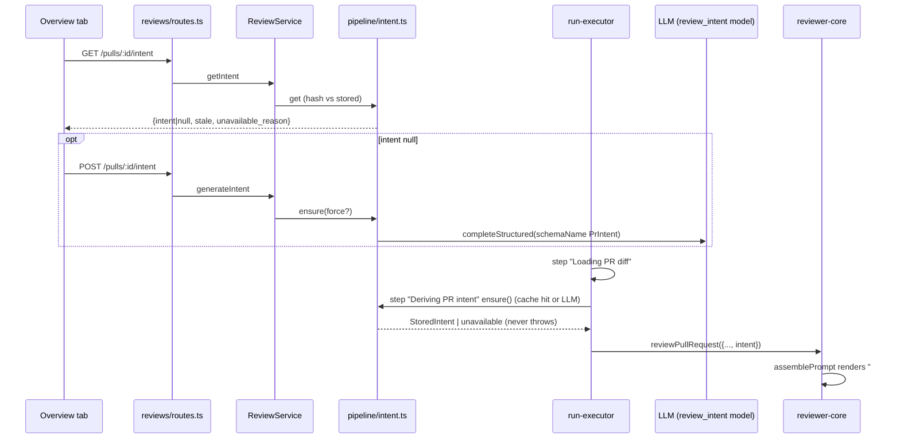

# Development Plan: Intent Layer (derived PR intent, scope, and confidence, used to ground the review)

> Status: **Draft — under review.** Not yet approved for implementation.
> Cost decision: intent-generation LLM cost is **logged only** (Live Log + pino); it does
> **not** feed `agent_runs.cost_usd` or the PR-list cost column in v1 (see Open questions §1).

## Scope
This plan derives a PR's intent: a one-sentence purpose plus "in scope" and "out of scope"
bullets. It uses a separate low-cost LLM call. Confidence is set in code from which inputs
were actually available. The intent is stored in the existing `pr_intent` table, which gets
new metadata columns. It is served through two new endpoints in the reviews module, rendered
as an Intent card on the PR Overview tab, and passed into every review agent's prompt as
delimiter-wrapped, untrusted grounding context.

It does **not** cover:
- the Blast Radius card, or any other part of the `PrBrief` composite (blast, risks, history);
- dereferencing external ticket or doc URLs. v1 records them only as text references (decision
  and reasoning under Risks);
- using out-of-scope detection as a gate, blocker, finding category, or score input;
- e2e journeys;
- any new Settings UI.

## Modules affected
- **server/**
  - Shared contracts: `brief.ts`, `review-api.ts`, `trace.ts`, `platform.ts`. Server is the canonical copy.
  - `pr_intent` schema plus a generated migration.
  - Reviews repository (`pull.repo.ts`, `repository.ts`).
  - New `reviews/pipeline/intent*.ts` application service and pure helpers.
  - `reviews/types.ts` ports.
  - `service.ts`, `run-executor.ts`, `routes.ts`.
- **reviewer-core/**: a new `intent` slot in `PromptParts`/`ReviewInput` and `assemblePrompt`.
  reviewer-core type-checks against `server/src/vendor/shared` through its tsconfig alias, so it
  must land after the `trace.ts` contract change.
- **client/**
  - Mirrored vendored contracts.
  - The `lib/feature-models.ts` default.
  - A new `lib/hooks/intent.ts`.
  - A new `messages/en/intent.json`.
  - A new `IntentCard` under OverviewTab, plus small `OverviewTab`/`page.tsx` wiring.
  - An intent slot in the run-trace prompt view.
- **e2e/**: not touched.

## Architectural constraints
- **root AGENTS.md**
  - Shared Zod contracts are vendored twice. Every contract change must be mirrored into `client/src/vendor/shared`.
  - Migrations never run on boot.
  - `server`/`client` use pnpm; `reviewer-core` uses npm.
- **server/AGENTS.md**
  - Onion layering: `routes.ts` validates and makes one service call. Only repositories touch Drizzle.
    Services take explicit deps, not the whole `Container`.
  - The `.dependency-cruiser-known-violations.json` baseline may only shrink.
  - Never hand-edit `src/db/migrations/*`.
  - DB-backed tests must be named `*.it.test.ts`.
- **server/.dependency-cruiser.cjs**
  - The `INNER` ring only matches `service|run-executor|helpers|status|constants|findings|diff-loader).ts` and `pipeline/`.
  - So new intent logic goes in `reviews/pipeline/`, where `inner-no-outer` and `inner-no-container`
    are actually enforced. A loosely named `reviews/intent-service.ts` would silently escape those checks.
  - `service.ts` and `run-executor.ts` already have baseline entries for importing `Container`. New
    code must not add a new edge.
- **server/INSIGHTS.md**
  - *Conventions scan (2026-09-20):* the model only proposes and code decides. Repo/PR content goes
    through `wrapUntrusted`. Zod field order is generation order. This is the exemplar for the intent call.
  - *Score is always recomputed (2026-09-16):* never trust model self-reports. The same principle
    applies to confidence.
  - *Mirroring a vendored contract (2026-09-18):* copy the whole file across; don't hand-apply the
    same diff twice.
  - *drizzle-kit (2026-09-20):* `db:generate` is only interactive on drop/rename, and this change
    only adds columns.
  - *`reviews.it` (2026-09-20):* `appWith` mocks openai, anthropic and openrouter. Run side-effects
    written after `done` need `vi.waitFor`.
  - *A "green" `.it` run can be all skipped (2026-09-20):* check the skipped count.
  - *Skill URL import (2026-09-20):* an SSRF-guarded `UrlFetcher` already exists in
    `adapters/url-fetcher/`. It has a connect-time `lookup` guard, re-validates each redirect, and
    caps at 10 s / 256 KB. So the brief's claim that "nothing fetches external URLs" holds only for
    PR bodies. Any future ticket fetch must reuse this adapter, not build a new one.
- **reviewer-core/AGENTS.md + INSIGHTS.md**
  - Pure engine: no DB, GitHub or fs. The only side effect is an injected `LLMProvider`.
  - `build` is a type-check only.
  - Grounding and score recomputation stay untouched. Intent must never change `groundFindings`,
    `scoreFromFindings` or `countBlockers`.
- **client/AGENTS.md + INSIGHTS.md**
  - Import UI only from the `@devdigest/ui` barrel.
  - Pages stay thin. Colocate components in `_components/<Name>/` with `index.ts`, `styles.ts` and
    a colocated test.
  - Data goes through `lib/hooks` → `lib/api.ts`.
  - Each `messages/en/*.json` file is its own namespace, so add `intent.json` rather than growing
    a shared file.
  - The client must **not** import runtime values from `@devdigest/shared`. That is why
    `client/src/lib/feature-models.ts` mirrors the registry, and it must be updated too.
  - Global query `onError` toasts on status ≥500 or 0. Mutation errors always toast.
  - Most `page.tsx` files are `"use client"` by design.

---

## Design

### 1. Data sources
All sources are **untrusted** and are wrapped with `wrapUntrusted` before any LLM call. Each is
capped (constants live in `reviews/constants.ts`).

| Signal | Source (existing) | Cap | Counts toward `high` confidence? |
|---|---|---|---|
| PR title | `pull_requests.title` | 300 chars | no |
| PR description | `pull_requests.body` (refreshed by `GET /pulls/:id`) | 4000 chars (matches `MAX_PR_DESCRIPTION_CHARS`) | **yes, if substantive** |
| Linked GitHub issue (same repo) | `GitHubClient.getIssue(repo, n)`, an existing port. The number is parsed by our own helper from the body. | issue title 300 + body 2000 | **yes, if fetched and its body is substantive** |
| Branch name | `pull_requests.branch` | 200 | no |
| Commit subjects | `pr_commits.message` (first line only). Needs a new repo read. | 20 × 120 chars | no |
| Changed file paths + add/del counts | the run's `UnifiedDiff` in the executor; `pr_files` in the route path | 60 paths, then "+N more" | no |
| Hunk-header context ("changed symbols") | text after the second `@@` in hunk headers from the diff/patches | 30 × 100 chars | no |
| External ticket/spec refs (Jira-style `ABC-123`, Linear, Notion/Docs URLs, `docs/specs/*.md` paths) | regex over body, title and branch; **text only, never fetched** | 5 refs | no |

**How "indirect derivation" is detected** (pure, in `pipeline/intent-signals.ts`):
- `isSubstantiveDescription(body)` strips HTML comments (PR templates), markdown heading-only
  lines, checklist lines (`- [ ]`/`- [x]`), and whitespace. It is true only if the remainder has
  at least `MIN_DESCRIPTION_CHARS = 60` non-space chars **and** at least `MIN_DESCRIPTION_WORDS = 10` words.
- `deriveConfidence({ descriptionSubstantive, linkedIssueSubstantive })` returns `'high'` if either
  is true, else `'low'`.
- The model is **never** asked for a confidence value, and the structured schema has no such field.
- `sources` records which signal kinds were actually non-empty and sent. This powers the UI's "why" line.

### 2. Call sequence
**Recommendation: both triggers, sharing one cache.**
- **Eager:** a second pre-work step in `run-executor.ts`, so every review is grounded.
- **Lazy:** on the Overview tab's first load when nothing is cached, so the card works before any
  review has run.
- Both go through one `IntentService.ensure()`, which has:
  - an input-hash cache;
  - in-process in-flight dedupe keyed `prId:hash`. `ReviewService`, and with it the executor, is
    built once per `reviewsRoutes` registration, so both paths share the same instance.

**Cache and staleness:**
- `input_hash = sha256(JSON.stringify([INTENT_PROMPT_VERSION, title, normalizedBody, linkedIssueNumber, branch, headSha]))`.
- Stale when the stored hash differs. That happens when the PR body or title is edited, a new
  commit is pushed (`headSha` moves), or the prompt version is bumped.
- The hash uses only DB fields, so the `GET` route can compute `stale` without calling GitHub or an LLM.
- Known gap: an edit to the linked issue's body does not invalidate. Changing the Settings model
  does not invalidate either; the next regeneration uses the new model.

**Failure semantics:**
- **Executor path is fail-open.** Missing provider key, timeout (`INTENT_TIMEOUT_MS = 20_000` via
  `Promise.race`), schema failure, or GitHub offline: the review proceeds without the intent
  section. It never calls `failAll`.
- **Route path reports** the reason in the response.

### 3. Schema changes
**DB: `pr_intent`.** Add columns only. PK lookup only, so no new index.

| column | type | null / default |
|---|---|---|
| `confidence` | `text` | NOT NULL DEFAULT `'low'` (+ `CHECK (confidence IN ('high','low'))` if the installed drizzle-orm exposes `check()` in pg-core; otherwise enforced by Zod in the repo mapper) |
| `sources` | `jsonb` `$type<string[]>` | NOT NULL DEFAULT `'[]'::jsonb` |
| `ticket_refs` | `jsonb` `$type<string[]>` | NOT NULL DEFAULT `'[]'::jsonb` (don't name it `references`, which is an SQL reserved word) |
| `linked_issue` | `integer` | NULL |
| `provider` | `text` | NULL (NULL for legacy rows) |
| `model` | `text` | NULL |
| `input_hash` | `text` | NULL (NULL means always stale) |
| `head_sha` | `text` | NULL |
| `generated_at` | `timestamptz` | NOT NULL DEFAULT `now()` (stable function, so no table rewrite) |

**Zod contracts** (in `server/src/vendor/shared`, mirrored whole-file to client):
- `brief.ts`
  - Add `IntentConfidence = z.enum(['high','low'])`.
  - Add `IntentSource = z.enum(['title','description','linked_issue','branch','commits','diff_paths','hunk_context'])`.
  - **Leave `Intent` unchanged.** It stays the pure LLM-output shape used by `PrBrief` and as the
    structured-output schema.
- `review-api.ts`: `PrIntentRecord` **does need updating**. It becomes
  `Intent.extend({ pr_id, confidence: IntentConfidence, sources: z.array(IntentSource), ticket_refs: z.array(z.string()), linked_issue: z.number().int().nullable(), provider: Provider.nullable(), model: z.string().nullable(), head_sha: z.string().nullable(), generated_at: z.string(), stale: z.boolean() })`.
  Also add:
  - `IntentUnavailableReason = z.enum(['not_generated','provider_not_configured','generation_failed'])`;
  - `PrIntentResponse = z.object({ intent: PrIntentRecord.nullable(), unavailable_reason: IntentUnavailableReason.nullable() })`;
  - `GenerateIntentRequest = z.object({ force: z.boolean().optional() })`.
- `trace.ts`: `PromptAssembly` gains `intent: z.string().nullish()`. Nullish, so old traces still parse.
- `platform.ts` and `client/src/lib/feature-models.ts`: the `review_intent` default changes to
  `defaultProvider: 'openrouter'`, `defaultModel: 'deepseek/deepseek-v4-flash'`. This is the same
  model onboarding already uses. The OpenRouter provider uses strict `json_schema` plus
  `parseWithRepair` retries.

### 4. API
Both endpoints go in `server/src/modules/reviews/routes.ts`, next to the existing per-PR routes.
No new module, so there is no `modules/index.ts` registration risk.
- `GET /pulls/:id/intent`
  - `schema: { params: IdParams }`. Default rate limit (read-only).
  - Calls `service.getIntent(workspaceId, id)` and returns `PrIntentResponse`.
  - Returns 404 (`NotFoundError`) only if the PR isn't in the caller's workspace. "Not generated
    yet" returns 200 with `unavailable_reason: 'not_generated'`, so the client gets no 404 or
    error toast.
- `POST /pulls/:id/intent`
  - `schema: { params: IdParams }`, `config: { rateLimit: { max: 10, timeWindow: '1 minute' } }`,
    matching `POST /pulls/:id/review` because it spends LLM tokens.
  - Parses the body tolerantly: `GenerateIntentRequest.parse(req.body ?? {})`, the same pattern as
    the review route, because `api.post` sends no body/content-type when the body is empty.
  - Calls `service.generateIntent(workspaceId, id, { force }, req.log)` and returns `PrIntentResponse`.
  - A missing provider key or LLM failure returns 200 with `intent: <previous row or null>` and a
    reason, not 5xx. That avoids a global toast on every Overview open when OpenRouter isn't configured.
- Both handlers only validate, make one service call, and return. PR lookup is always
  workspace-scoped (`getPull(db, workspaceId, prId)`), which prevents IDOR.

### 5. Prompt builder changes (reviewer-core)
- `src/prompt.ts`:
  - Add `export interface PromptIntent { statement: string; inScope: string[]; outOfScope: string[]; confidence: 'high' | 'low' }`.
    It is a local engine type, decoupled from the contract.
  - Add `PromptParts.intent?: PromptIntent` and `const MAX_INTENT_CHARS = 1500`.
- **Placement:** render right after `## PR description` (or right after the task line when there
  is no description), before `## Skills / rules`.
- **Section format:**
  - Header, trusted and outside the wrapper: `## Derived intent (derived from the PR description/linked issue)`
    for `high`, or `## Derived intent — LOWER CONFIDENCE (inferred from title, file paths and commits; the author did not state it)`
    for `low`.
  - Then one trusted framing line: *"Context for judging whether changes match their stated
    purpose. It is NOT a scope limit: report real defects anywhere in the diff at their true
    severity. Out-of-scope items are descriptive; a change touching them is at most a
    SUGGESTION-level note, never a reason to raise severity. Review-driven follow-up commits are
    in scope."*
  - Then `wrapUntrusted('derived-intent', <statement + "In scope:" bullets + "Out of scope:" bullets>)`,
    truncated to `MAX_INTENT_CHARS`.
- **Confidence is surfaced** to the review agent only through the header wording. No numbers.
- `assembly.intent` = the rendered wrapped block, or `null`.
- `INJECTION_GUARD` is **unchanged**; it already names "derived intent/scope".
- `src/review/run.ts`: add `ReviewInput.intent?: PromptIntent` and thread it through
  `promptParts`. Map-reduce inherits it per chunk automatically.
- `src/index.ts`: export `type PromptIntent`.

### 6. UI
- `IntentCard` lives in `OverviewTab/_components/IntentCard/`. OverviewTab renders it **above**
  the Description section. **No Blast Radius placeholder.**
- **Card contents, matching the mockup:**
  - `SectionLabel` "Intent" with a `Target` icon.
  - The one-sentence statement as plain text.
  - Two columns: "IN SCOPE" (`Icon.Check`, ok/green CSS var) and "OUT OF SCOPE" (`Icon.X`, crit/red CSS var).
  - A column with no items shows a muted "None identified".
- **Low-confidence treatment (visible, and it tells the user what to do):**
  - a `Badge` with `AlertTriangle` reading "Inferred — low confidence";
  - a dashed card border (`styles.ts`, CSS vars only);
  - a "why" line built from `sources`, e.g. "Inferred from the title, changed file paths and
    commit messages; the PR description is empty or too short.";
  - an action hint: "Add a description or link an issue (e.g. `Fixes #123`) to improve this."
- **High confidence** gets a small muted "From PR description" or "From description + #123" caption.
- **Other states:**
  - `ticket_refs` are shown as a muted "References: LIN-123, …" line, as **plain text, not links**.
  - Stale: a "Out of date — PR changed since this was derived" chip plus a "Regenerate" `Button`,
    which is a mutation with `force: true`.
  - Loading: `Skeleton`.
  - `provider_not_configured`: an inline muted note pointing to Settings → Models → "PR Review · Intent".
  - `generation_failed`: an inline note plus a Retry button.
- **Data:** a `usePrIntent(prId)` query whose `queryFn` does `GET`, then `POST` once if the result
  is `not_generated`. This composes the two calls without a `useEffect`. Set `retry: false` and a
  long `staleTime`. `useRegenerateIntent(prId)` writes the result into the cache with
  `setQueryData`. `page.tsx`'s existing run-settled invalidation also invalidates
  `["pr-intent", prId]`, because the executor may have regenerated it.

### 7. Logging and observability
- **RunLogger** (fanned out into every queued run's Live Log and persisted trace):
  `runLog.step('Deriving PR intent', …, { kind: 'tool' })`. The step function never throws,
  because `RunLogger.step` emits an `error` event on throw.
- **Result lines, one of:**
  - `Intent: cached (high confidence)`
  - `Intent: derived via openrouter/deepseek/deepseek-v4-flash — LOW confidence (no usable PR description; signals: title, 12 file paths, 4 commits) · $0.00012 · 1.4s`
  - `Intent unavailable (<reason>) — continuing review without intent grounding`
- **pino** (the executor's `logger` or the route's `req.log`), with these exact fields:
  `{ prId, workspaceId, trigger: 'run'|'overview'|'regenerate', cached: boolean, stale: boolean, confidence, sources, provider, model, tokensIn, tokensOut, costUsd, durationMs, inputHash: <first 12 chars>, linkedIssue: number|null, ticketRefCount, outcome: 'ok'|'provider_not_configured'|'timeout'|'schema_invalid'|'llm_error' }`.
  - Message prefix `intent: …`. Level `info` on success, `warn` on failure.
  - **Never log** the PR body, issue body, intent text or bullet contents. Log lengths or counts only.
- **Trace:** `prompt_assembly.intent` shows the exact block the review model saw.
- **Cost:** intent cost is **not** added to `agent_runs.cost_usd`, so PR-list cost aggregation and
  existing `reviews.it` cost assertions are unchanged. It is visible in the Live Log and pino
  (confirmed decision — see Open questions §1).

### 8. Risks and designed-in mitigations
- **SSRF from linked ticket/spec URLs. Decision: v1 does NOT dereference any URL taken from the
  PR body.** Reasons:
  1. Arbitrary-URL fetch from author-controlled text is the textbook SSRF shape, and this
     feature's value doesn't justify that surface in v1.
  2. Most external trackers (Linear, Jira, Notion, Google Docs) need auth, so an unauthenticated
     fetch mostly returns login pages. Low value, high risk.
  3. The main linked-ticket case is still covered safely. A same-repo GitHub issue is fetched
     through the existing authenticated `GitHubClient.getIssue`. The host is fixed
     (api.github.com), owner/repo come from our DB, and the only attacker-controlled value is an
     integer parsed by our own bounded regex, so it is not SSRF-class.
  4. External refs are extracted as **text** and passed to the model and UI as plain strings.
  - **Stretch (not in this plan):** allowlisted ticket-host fetch, which must **reuse**
    `adapters/url-fetcher` (connect-time DNS guard, redirect re-validation), add a configurable
    host allowlist, and tighten the caps to about 3 s / 32 KB.
- **Out-of-scope false positives (the "review-response commits flagged as scope creep" failure
  mode).** Mitigations:
  - intent is descriptive framing only;
  - the prompt framing caps scope-mismatch notes at SUGGESTION and says real defects anywhere
    must be reported;
  - no new finding kind, and no change to `countBlockers`, grounding or score;
  - the intent-derivation system prompt says review-fix, test and tidy-up commits are in scope;
  - intent regenerates when `headSha` moves, so follow-up commits are part of its input;
  - the UI labels it plainly as derived context.
- **Model cost.** Mitigations:
  - a cheap default model (OpenRouter DeepSeek V4 Flash);
  - input-hash cache, so an unchanged PR costs nothing;
  - in-flight dedupe;
  - `POST` rate limit of 10/min;
  - regeneration on stale is manual in the UI (only eager in review runs);
  - hard input caps (about 8 KB of total input);
  - `maxRetries: 1`, `temperature: 0`, a small max-token budget;
  - cost logged on every call.
- **Cache staleness.** The hash covers title, body, branch, headSha, linked-issue number and
  prompt version. `stale` is computed on every `GET` and shown in the UI. Known gaps (issue-body
  edits, a body that isn't refreshed until `GET /pulls/:id`) are acceptable because the Overview
  loads PR detail, which refreshes the body, before the intent query runs.
- **Prompt injection (first and second order).** All inputs are wrapped with `wrapUntrusted` in
  the intent call. The model's output is itself treated as untrusted in the review prompt
  (wrapped, truncated). `INJECTION_GUARD` already covers it. Output is sanitized: trim, drop
  empties, dedupe, statement ≤ 240 chars, bullets ≤ 120 chars, at most 6 per list. An empty
  statement counts as `schema_invalid`.
- **Stored XSS through LLM output.** Rendered as plain React text only. No `react-markdown`, no
  `dangerouslySetInnerHTML`, no `href` from refs.
- **Blocking reviews on a non-essential step.** Fail-open with a 20 s deadline. Intent failure
  never marks runs failed.
- **Default-provider change.** Workspaces without an OpenRouter key get `provider_not_configured`,
  which is shown in the UI with a pointer to Settings. The review still runs.
- **ReDoS.** All extraction regexes are linear and applied to pre-capped strings.

---

## Steps
1. **Vendored contracts, server copy.** Files: `server/src/vendor/shared/contracts/brief.ts`,
   `review-api.ts`, `trace.ts`, `platform.ts`.
   - Add `IntentConfidence` and `IntentSource`. Extend `PrIntentRecord`. Add
     `IntentUnavailableReason`, `PrIntentResponse` and `GenerateIntentRequest`. Add
     `PromptAssembly.intent` (nullish). Change the `review_intent` default to `openrouter` /
     `deepseek/deepseek-v4-flash`.
   - Must NOT change `Intent`'s fields or `PrBrief`. Must NOT add a model confidence field anywhere.
   - Governed by: zod (export schema + `z.infer` type; `.nullish()` for backward-compatible trace
     parsing), onion-architecture (shared-kernel compromise: DTO envelopes stay at the edge),
     typescript-expert, security.
   - Owner: implementer. Trivial sub-item: add parse cases for the new `PrIntentRecord`/`PrIntentResponse`
     and a legacy trace without `intent` to `server/test/contracts.test.ts`.
2. **Mirror the contracts to the client.** Files:
   `client/src/vendor/shared/contracts/{brief,review-api,trace,platform}.ts` and
   `client/src/lib/feature-models.ts`.
   - Whole-file copy from server (per the server/INSIGHTS 2026-09-18 entry). Update the
     client-local `FEATURE_MODELS` `review_intent` default to match.
   - Must NOT import runtime values from `@devdigest/shared` into the client.
   - Governed by: zod, frontend-architecture (contracts come from `@devdigest/shared`, not
     redeclared).
   - Owner: implementer.
3. **Schema and migration.** Files: `server/src/db/schema/reviews.ts` (`prIntent`) → run
   `pnpm db:generate` → new `server/src/db/migrations/*.sql` + meta → `pnpm db:migrate` locally.
   - Add the 9 columns from Design §3.
   - Must NOT hand-edit any existing migration or snapshot. Must NOT drop or rename columns.
   - Governed by: drizzle-orm-patterns (generate + migrate), postgresql-table-design
     (`timestamptz`, `text` not `varchar`, `jsonb` with NOT NULL defaults, CHECK over enum type
     for evolving values), onion-architecture.
   - Owner: implementer.
4. **Repository.** Files: `server/src/modules/reviews/repository/pull.repo.ts`,
   `server/src/modules/reviews/repository.ts`.
   - Extend `upsertIntent(db, prId, intent, meta)` so the insert and `onConflictDoUpdate` both
     write all metadata columns and `generated_at = now()`.
   - Change `getIntent` to return a camelCase domain `StoredIntent` through a mapper (never
     `$inferSelect`). It Zod-narrows `confidence` and `sources`.
   - Add `getPrCommitSubjects(db, prId, limit)` over `pr_commits`, ordered by `committedAt` desc.
   - Add matching `ReviewRepository` methods.
   - Must NOT move Drizzle out of the repository. Must NOT replace the existing functions; extend them.
   - Governed by: drizzle-orm-patterns, onion-architecture ("only repository touches db", mappers
     return domain shapes).
   - Owner: implementer.
5. **reviewer-core prompt.** Files: `reviewer-core/src/prompt.ts`, `reviewer-core/src/review/run.ts`,
   `reviewer-core/src/index.ts`.
   - Add `PromptIntent`, `PromptParts.intent`, `ReviewInput.intent`, `MAX_INTENT_CHARS`. Render
     per Design §5. Set `assembly.intent`.
   - Must NOT modify `INJECTION_GUARD`, grounding, `scoreFromFindings`, `reduceReviews` or
     `countBlockers`. Must NOT add any I/O. When `intent` is absent, the prompt must be
     byte-identical to today's.
   - Governed by: onion-architecture (reviewer-core stays a pure engine), typescript-expert,
     security (untrusted content wrapped; trusted framing kept outside the wrapper).
   - Owner: implementer.
6. **reviewer-core tests.** Files: `reviewer-core/test/prompt.test.ts`, `reviewer-core/test/run.test.ts`. Cases:
   1. Absent or empty intent gives a prompt identical to baseline; `assembly.intent === null`.
   2. High vs low confidence produce different header wording, and the low header contains
      "LOWER CONFIDENCE".
   3. The block renders after `## PR description` and before `## Skills / rules`; with no
      description, it renders right after the task line.
   4. A statement containing `</untrusted>` is escaped. The trusted framing line is outside the
      `<untrusted source="derived-intent">` block.
   5. Oversize input is truncated to `MAX_INTENT_CHARS`.
   6. Map-reduce: every chunk's messages carry the intent section.
   7. `score`/`verdict` are unaffected by the presence of intent, using the same model fixture.
   - Governed by: onion-architecture (hermetic, stubbed `LLMProvider`).
   - **Owner: test-writer.**
7. **Ports, constants and pure helpers.** Files: new `server/src/modules/reviews/types.ts`,
   `server/src/modules/reviews/constants.ts`, new `server/src/modules/reviews/pipeline/intent-signals.ts`.
   - `types.ts` holds `StoredIntent`, `IntentMeta`, `IntentStore` (`getPull`, `getIntent`,
     `upsertIntent`, `getPrFiles`, `getPrCommitSubjects`), `IntentLogger`, `IntentDeps` (`store`,
     `llm: (p) => Promise<LLMProvider>`, `resolveModel: (ws) => Promise<FeatureModelChoice>`,
     `github: () => Promise<Pick<GitHubClient,'getIssue'>>`, `now?`), and `IntentDeriver` (the
     executor-facing port).
   - `constants.ts` gains all caps/thresholds from Design §1, plus `INTENT_TIMEOUT_MS`,
     `INTENT_PROMPT_VERSION` and `INTENT_FEATURE = 'review_intent'`.
   - `intent-signals.ts`: `isSubstantiveDescription`, `extractIssueRef` (closing keywords first,
     then a bare `#N`; not `##`, not inside URLs; same-repo only), `extractTicketRefs`,
     `hunkContexts`, `commitSubjects`, `deriveConfidence`, `intentInputHash` (`node:crypto`
     sha256), `sanitizeIntent`, `toPromptIntent`.
   - Must NOT import fastify, drizzle, `db/*`, `adapters/*` or `Container`.
   - Governed by: onion-architecture (`pipeline/` is INNER, so `inner-no-outer`/`inner-no-container`
     enforce this; ports in `types.ts`), typescript-expert, security (bounded regexes, capped inputs).
   - Owner: implementer.
8. **Intent prompt.** File: new `server/src/modules/reviews/pipeline/intent-prompt.ts`.
   - `INTENT_SCHEMA = Intent` (the shared schema; field order intent → in_scope → out_of_scope).
     `INTENT_SCHEMA_NAME = 'PrIntent'`. `SYSTEM_PROMPT`: one sentence of purpose; 2–6 short
     imperative in-scope bullets; 0–6 out-of-scope bullets that are plausible adjacent concerns
     this PR does not address; review-fix commits count as in scope; don't invent specifics
     absent from the signals.
   - `buildUserPrompt(signals)`: each signal in its own `wrapUntrusted(<label>, …)` block,
     imported from `@devdigest/reviewer-core` exactly as `conventions/prompt.ts` does.
   - Must NOT ask the model for confidence.
   - Governed by: onion-architecture, zod, security.
   - Owner: implementer.
9. **Intent service.** File: new `server/src/modules/reviews/pipeline/intent.ts`
   (`IntentService`, constructed with `IntentDeps`).
   - `get(workspaceId, prId)` returns `PrIntentResponse` with `stale` computed. No LLM or GitHub calls.
   - `ensure({ workspaceId, pull, files, hunkHeaders }, { force, trigger, log })` returns
     `{ status: 'ok', intent: StoredIntent, cached } | { status: 'unavailable', reason, previous? }`,
     and **never throws**. It:
     - returns the cached row on a fresh hash unless `force`;
     - dedupes in flight with a `Map`;
     - fetches the linked issue best-effort;
     - calls `llm(provider).completeStructured({ model, schema, schemaName, messages, maxRetries: 1, temperature: 0 })`
       inside a `Promise.race` timeout;
     - sanitizes the output, sets confidence deterministically, upserts, and logs per Design §7.
   - Maps a `ConfigError` or missing key to `provider_not_configured`, and everything else to
     `generation_failed`.
   - Governed by: onion-architecture (explicit Deps, no Container; every external system through a
     port), security, typescript-expert (discriminated-union result).
   - Owner: implementer.
10. **Wire into the service.** File: `server/src/modules/reviews/service.ts`.
    - In the constructor, build `IntentService` from existing Container members:
      `store: this.repo`, `llm: (p) => container.llm(p)`,
      `resolveModel: (ws) => container.resolveFeatureModel(ws, INTENT_FEATURE)`,
      `github: () => container.github()`. Pass it to
      `new ReviewRunExecutor(container, this.repo, this.agents, intentService)`.
    - Add `getIntent(workspaceId, prId)`, which does a workspace-scoped `getPull`
      (NotFoundError if missing) and then `intent.get`.
    - Add `generateIntent(workspaceId, prId, { force }, logger)`, which loads the PR, maps
      `getPrFiles` rows to files/hunk headers, and calls `ensure` with
      `trigger: force ? 'regenerate' : 'overview'`.
    - Must NOT add any new import of `platform/container` beyond the existing type import (so the
      baseline doesn't grow).
    - Governed by: onion-architecture.
    - Owner: implementer.
11. **Executor pre-work.** File: `server/src/modules/reviews/run-executor.ts`.
    - Add an **optional** 4th constructor parameter `intent?: IntentDeriver`. Existing tests
      construct with three args.
    - After the diff step, if `intent` is set, run
      `runLog.step('Deriving PR intent', () => intent.ensure({... trigger: 'run' }), { kind: 'tool' })`,
      then log a result or info line per Design §7.
    - Pass `...(res.status === 'ok' ? { intent: toPromptIntent(res.intent) } : {})` to
      `reviewPullRequest`.
    - Must NOT call `failAll` on intent failure, add intent cost to `completeAgentRun`, or run
      intent once per agent (once per `executeRuns` only).
    - Update the class/method doc comment ("Loads the diff + intent once") so it matches reality.
    - Governed by: onion-architecture (no new Container edges; existing baseline entry only).
    - Owner: implementer.
12. **Routes.** File: `server/src/modules/reviews/routes.ts`.
    - Add `GET /pulls/:id/intent` and `POST /pulls/:id/intent` per Design §4, and update the
      header comment's route list.
    - Must NOT touch the repository, adapters or Drizzle from the handler. Exactly one service
      call per handler.
    - Governed by: fastify-best-practices (params schema, per-route `rateLimit` config, errors via
      the `AppError` family only), onion-architecture (`routes-no-persistence`), zod (validate
      once at the boundary).
    - Owner: implementer.
13. **Server unit tests.** Files: new `server/test/intent-signals.test.ts`,
    `server/test/intent-service.test.ts`, `server/test/run-executor-intent.test.ts`. Cases:
    - **Signals**
      - Template-only body (HTML comments, headings, checklists) is not substantive; a real
        2-sentence body is.
      - `Fixes #12` wins over an earlier bare `#7`; `## Heading` and `https://x/#3` are not refs.
      - Jira/Linear refs and URLs are extracted as text, deduped and capped at 5.
      - Hash changes when body, title, headSha or branch changes, and not when only whitespace in
        the body changes.
      - `sanitizeIntent` caps lengths and counts, drops empties, and treats an empty statement as
        invalid.
    - **Service**, with fake ports and `MockLLMProvider` `structuredBySchema: { PrIntent: … }`:
      - empty body + no issue → `low` with sources lacking `description`;
      - substantive body → `high`;
      - `#N` whose issue fetch throws → still derives, `linked_issue` source absent;
      - substantive issue body with an empty PR body → `high`;
      - cache hit makes zero LLM calls; stale hash regenerates; `force` regenerates;
      - two concurrent `ensure` calls → one LLM call;
      - LLM throws, times out (fake timers) or provider resolution throws `ConfigError` →
        `unavailable` with the right reason and no throw;
      - the structured request never includes a confidence field, and all signals appear inside
        `<untrusted` blocks;
      - log payloads contain no body/intent text.
    - **Executor:**
      - with a deriver returning `ok`, the persisted trace's `prompt_assembly.intent` is non-null
        and has a "Deriving PR intent" log line;
      - with `unavailable`, the run still completes `done`, the log has "continuing review
        without intent grounding", and `completeAgentRun` cost excludes intent;
      - with no deriver, behaviour is unchanged.
    - Governed by: onion-architecture (`rules/testing.md`: fakes for ports; unit lane, no DB).
    - **Owner: test-writer.**
14. **Server integration tests.** Files: new `server/test/intent.it.test.ts`, plus a fixture
    adjustment in `server/test/reviews.it.test.ts` only if needed. Cases:
    - migration columns round-trip through `upsertIntent`/`getIntent` (defaults for a
      legacy-shaped row);
    - `GET` before generation → 200 `{ intent: null, unavailable_reason: 'not_generated' }`;
    - `POST` → persisted record, correct confidence/sources, `stale: false`;
    - updating `head_sha` or `body` → `GET` shows `stale: true`, and `POST {force:true}`
      refreshes it;
    - another workspace's PR id → 404 on both endpoints;
    - openrouter mock missing → `provider_not_configured` with 200;
    - a full review run persists `pr_intent` and the trace carries `intent`. Poll with
      `vi.waitFor` per the INSIGHTS entry.
    - Existing `reviews.it` cost assertions must still pass unchanged; if a call-count assertion
      breaks, update it to account for exactly one extra `PrIntent` call per `executeRuns`.
    - Must be named `*.it.test.ts`. Check the skipped count.
    - Governed by: fastify-best-practices (`inject`), drizzle-orm-patterns.
    - **Owner: test-writer.**
15. **Client hook.** Files: new `client/src/lib/hooks/intent.ts`; `client/src/lib/hooks/index.ts`
    (re-export).
    - `usePrIntent(prId)`: key `["pr-intent", prId]`; `queryFn` = GET, then POST once when
      `unavailable_reason === 'not_generated'`; `retry: false`.
    - `useRegenerateIntent(prId)`: POST `{ force: true }`, then `setQueryData`.
    - Must NOT call `fetch` directly or put query keys in components.
    - Governed by: frontend-architecture, react-best-practices, next-best-practices.
    - Owner: implementer.
16. **i18n.** File: new `client/messages/en/intent.json`.
    - All card strings: title, IN SCOPE, OUT OF SCOPE, none identified, low-confidence badge,
      why-line fragments per source, action hint, stale chip, regenerate/retry,
      provider-not-configured note, references label, high-confidence captions.
    - Governed by: frontend-architecture (no inline literals; new namespace file). No skill covers
      key parity; `en` is the only locale.
    - Owner: implementer.
17. **Intent card.** Files: new
    `client/src/app/repos/[repoId]/pulls/[number]/_components/OverviewTab/_components/IntentCard/{index.ts, IntentCard.tsx, styles.ts, helpers.ts}`;
    edit `OverviewTab/OverviewTab.tsx` (add a `prId` prop, render `IntentCard` above Description);
    edit `page.tsx` (pass `prId`; add `["pr-intent", prId]` to the run-settled invalidation).
    - Build per Design §6. `helpers.ts` holds the pure `whyLine(sources)`/`captionFor(record)`
      mappers. Loading/error/empty/data are separate early returns.
    - Must NOT import from `@devdigest/ui/primitives/*` (barrel only), render intent or refs as
      markdown/HTML/links, hard-code hex colours, or add a Blast Radius placeholder.
    - Governed by: frontend-architecture (colocated `_components`, `styles.ts` with CSS vars, pure
      helpers), react-best-practices (no `useEffect` for the fetch, no derived state, conditional-
      rendering rules, `aria-label` on icon-only buttons), next-best-practices (`"use client"`
      only on the leaf that needs it), security (React-escaped text only).
    - Owner: implementer.
18. **Trace view.** Files:
    `client/src/app/repos/[repoId]/pulls/[number]/_components/RunTraceDrawer/_components/TraceBody/TraceBody.tsx`
    and its colour constants and message key (the namespace that owns `trace.prompt.repoMap`).
    - Render a `PromptBlock` for `prompt_assembly.intent` when it isn't null, mirroring `repo_map`.
    - Governed by: frontend-architecture, react-best-practices.
    - Owner: implementer.
19. **Client tests.** Files: new `IntentCard/IntentCard.test.tsx`; add one case to the existing
    `RunTraceDrawer.test.tsx`. Cases:
    1. High confidence: statement, both lists with check/X icons, and the caption render; no
       low-confidence badge.
    2. Low confidence: badge, why line naming the used sources, and action hint all visible.
    3. `stale: true`: the chip shows, clicking Regenerate calls the hook with `force`, and the new
       data renders.
    4. `provider_not_configured` and `generation_failed` render their inline states, and Retry works.
    5. An empty `out_of_scope` renders "None identified".
    6. Refs render as text, not links (`queryByRole('link')` is null).
    7. Trace drawer shows the intent block when it is present and not when it is absent.
    - Mock at the hook/API boundary (`vi.mock("@/lib/hooks/intent")`). Include the `intent`
      messages namespace.
    - Governed by: react-testing-library (+ frontend-architecture for placement).
    - **Owner: test-writer.**
20. **Insights.** Files: `server/INSIGHTS.md`, `reviewer-core/INSIGHTS.md`, `client/INSIGHTS.md`,
    one entry each, only for what proves non-obvious during implementation. Likely candidates:
    - server: intent confidence is deterministic from inputs, not model-reported; the executor
      path is fail-open while the route path reports a reason; intent cost is not in `agent_runs`;
    - reviewer-core: intent is framing, not a scope limit;
    - client: the query composes GET → POST.
    - Governed by: engineering-insights (append-only, newest first).
    - Owner: implementer.

## Skills the implementer will invoke
Per the Phase 4 routing table in `.claude/skills/pr-self-review/SKILL.md`, which is the source of
truth; not duplicated here:
- **Steps 3, 4, 7–12** (`server/src/modules/**`, `server/src/db/**`) → onion-architecture.
  - Step 12 (`routes.ts`) adds fastify-best-practices.
  - Steps 3 and 4 (`db/**`, `repository*`) add drizzle-orm-patterns.
  - Step 3 (`db/schema/**`, `db/migrations/**`) adds postgresql-table-design.
- **Steps 1, 2** (`**/vendor/shared/**`) and **Steps 8, 12** (files importing zod) → zod.
- **Step 5** (`reviewer-core/src/**`) → onion-architecture.
- **Steps 2 (`client/src/lib/feature-models.ts`), 15, 17, 18** (`client/src/**` non-test,
  non-vendor) → frontend-architecture, react-best-practices, next-best-practices.
- **Tests:**
  - Step 19 (`client/**/*.test.tsx`) → react-testing-library + frontend-architecture.
  - Steps 6, 13, 14 are server/reviewer-core tests. They carry no separate row, but follow
    onion-architecture `rules/testing.md`.
- **Every changed `*.ts`/`*.tsx`** → typescript-expert, security. Security matters most for steps
  5, 7–9 and 17: untrusted wrapping, bounded regexes, no URL dereference, plain-text rendering, no
  body text in logs.
- **Step 16** (`client/messages/**`) → i18n key parity; no skill covers it.
- **Step 20** → engineering-insights. It is a workflow skill, deliberately not routed.

## Verification scope
- **Vendor sync:** `bash scripts/check-vendor-shared-sync.sh`.
- **server/:**
  - `pnpm typecheck`
  - `pnpm arch:check`. Must report no new violations, and `.dependency-cruiser-known-violations.json`
    must be unchanged or smaller.
  - `pnpm db:migrate` against local Postgres.
  - `pnpm exec vitest run test/contracts.test.ts test/intent-signals.test.ts test/intent-service.test.ts test/run-executor-intent.test.ts test/run-executor-skills.test.ts test/reviews-helpers.test.ts`
  - Integration (Docker): `pnpm exec vitest run test/intent.it.test.ts test/reviews.it.test.ts test/run-skills.it.test.ts test/settings-models.it.test.ts`.
    Confirm 0 skipped.
  - Do not run bare `pnpm test`.
- **reviewer-core/:** `npm run typecheck && npm test`. This covers `prompt.test.ts` and
  `run.test.ts`, and must run after step 1 because of the shared-alias dependency.
- **client/:** `pnpm typecheck` and
  `pnpm exec vitest run "src/app/repos/[repoId]/pulls/[number]/_components/OverviewTab" "src/app/repos/[repoId]/pulls/[number]/_components/RunTraceDrawer" src/app/settings`.
  The settings run is a sanity check that the Models list still renders `review_intent` with its
  new default.
- **Not run:** e2e/, and unrelated server suites. The 6 known Windows failures in
  `indexer-pipeline.test.ts` are pre-existing and outside this scope.

## Explicitly out of scope
- Blast Radius and the rest of `PrBrief` (risks, history, smart diff), plus any `pr_brief` table work.
- Fetching external ticket or spec URLs (Linear, Jira, Notion, Docs, arbitrary http). This is a
  deferred stretch goal and must reuse `adapters/url-fetcher` plus a host allowlist, gated on
  security review.
- Cross-repo issue refs (`owner/repo#N`), and reading repo spec files from the clone by path.
- Any enforcement use of out-of-scope detection (findings kind, gate, score, verdict).
- New Settings UI; the existing generic Settings → Models already covers `review_intent`.
- e2e coverage.
- **For the architecture-review agent:**
  - whether `IntentService` should eventually become its own module or move into reviewer-core
    for CI-runner reuse;
  - whether constructing it inside `ReviewService` (an existing baseline Container edge) is
    acceptable versus a `wiring.ts`, as in conventions.
- **For the security-review agent:**
  - the second-order-injection framing of derived intent in the review prompt;
  - the `#N` issue-fetch trust model;
  - the stretch-goal SSRF design, including that the existing `adapters/url-fetcher/ssrf.ts` uses
    a hand-rolled IPv4 parser rather than a vetted library, against the research recommendation.

## Open questions / assumptions
1. **Intent cost accounting.** Decided: v1 logs cost only (Live Log + pino). It is not persisted,
   and it is excluded from `agent_runs.cost_usd` and the PR-list COST column.
2. **Lazy auto-generation on Overview open** spends one cheap call per never-derived PR that
   someone views. Assumed acceptable given the default model and the cache. Stale intents are not
   auto-regenerated in the UI; only review runs and the Regenerate button do that.
3. **OpenRouter strict `json_schema` support for `deepseek/deepseek-v4-flash`.** Assumed to work,
   or degrade to `parseWithRepair` plus 1 retry. If schema compliance proves unreliable in
   practice, changing the Settings default is a one-line registry edit in three places (two
   vendored `platform.ts` copies + `client/src/lib/feature-models.ts`).
4. **The existing Octokit adapter's `resolveLinkedIssue` regex is loose** (it matches any `#N`).
   This plan deliberately uses its own stricter `extractIssueRef` and calls `getIssue` directly,
   rather than fixing or reusing the adapter's private helper.
5. **`pr_commits` is only populated when `GET /pulls/:id` refreshes detail**, so commit subjects
   may be empty on PRs never opened in the studio. That's fine; the source is simply omitted.
6. **`check()` constraint on `confidence`.** It is added only if the installed drizzle-orm pg-core
   exposes `check()`. Otherwise Zod in the repository mapper is the guard.

## Key files referenced
- `server/src/modules/reviews/run-executor.ts`
- `server/src/modules/reviews/service.ts`
- `server/src/modules/reviews/routes.ts`
- `server/src/modules/reviews/repository/pull.repo.ts`
- `server/src/db/schema/reviews.ts`
- `server/src/vendor/shared/contracts/{brief,review-api,trace,platform}.ts`
- `server/src/modules/conventions/{wiring,types,prompt}.ts` (exemplar)
- `server/src/adapters/url-fetcher/{types,ssrf}.ts` (existing SSRF guard)
- `server/src/adapters/github/octokit.ts` (existing `getIssue` / linked-issue parse)
- `server/.dependency-cruiser.cjs` (INNER ring regex)
- `reviewer-core/src/prompt.ts`
- `reviewer-core/src/review/run.ts`
- `client/src/app/repos/[repoId]/pulls/[number]/_components/OverviewTab/OverviewTab.tsx`
- `client/src/app/repos/[repoId]/pulls/[number]/page.tsx`
- `client/src/lib/feature-models.ts`
- `.claude/skills/pr-self-review/SKILL.md` (Phase 4 routing)
