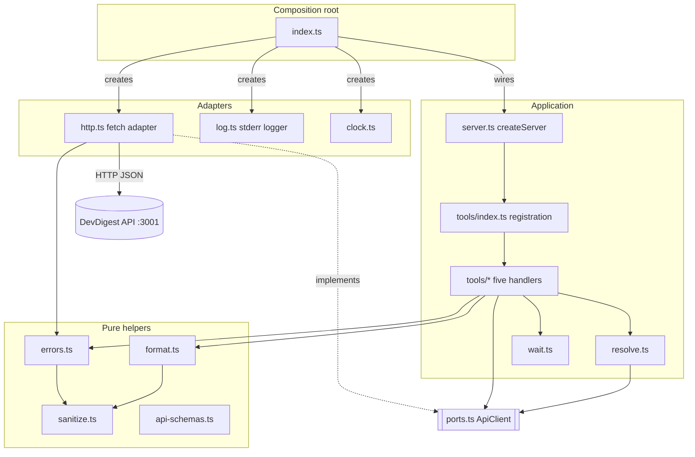
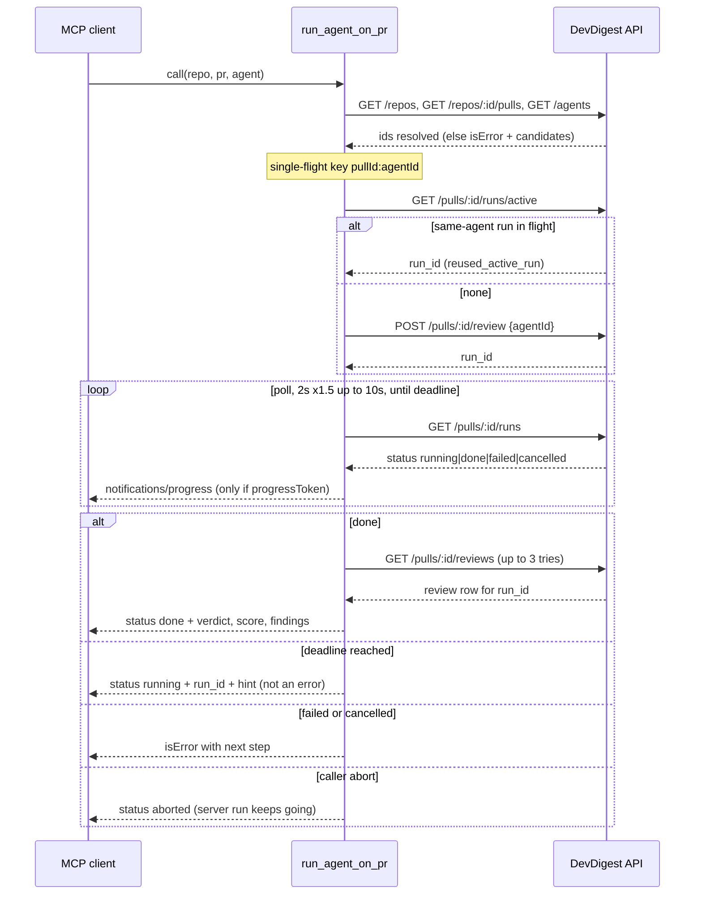

# 06 - DevDigest local stdio MCP server (`mcp-server/`)

Status: implemented (L04). This document describes the code as it exists. The pre-implementation plan is
[06-mcp-server-plan.md](06-mcp-server-plan.md); differences are listed in "Plan/code discrepancies" at the end.
Sources: `mcp-server/src/**`, `mcp-server/test/**`, `mcp-server/INSIGHTS.md`, `mcp-server/AGENTS.md`,
`mcp-server/README.md`, `.mcp.json`.

## 1. Purpose and scope

`@devdigest/mcp-server` (`mcp-server/package.json`) is a Node/TypeScript MCP server over **stdio only** that lets a
coding agent (Claude Code) drive DevDigest PR reviews. It is an **HTTP client** of the DevDigest API (default
`http://localhost:3001`); it has no DB access and imports nothing from `server/`, `client/` or `reviewer-core/`
(`mcp-server/AGENTS.md`). Runtime deps: `@modelcontextprotocol/server` 2.3.0 and `zod` 4.6.5; `tsx` runs the TS
source directly (no build step) (`mcp-server/package.json`).

It exposes exactly five tools in fixed order (`src/tools/index.ts:61-67`): `list_agents`, `run_agent_on_pr`,
`get_findings`, `get_conventions`, `get_blast_radius`.

Out of scope: HTTP/SSE transport, a real blast-radius implementation (L04 homework, [07-blast-radius.md](07-blast-radius.md)),
and any change to the API packages.

## 2. Architecture

Ports/adapters ("onion") layout. Dependency rule (`mcp-server/AGENTS.md`, `INSIGHTS.md` 2026-10-03 "Keep ports and
error classes out of http.ts"): `tools/*` depend on `resolve`, `format`, `wait` and the `ApiClient` **port**
(`src/ports.ts`), never on `http.ts`. Only `http.ts` implements the port with real `fetch`; only `index.ts` wires
concrete adapters (composition root). `format.ts`, `sanitize.ts` and `wait.ts` do no I/O (clock, sleep, fetch are
injected). Tools are SDK-independent; `tools/index.ts` is the only file adapting the SDK `ServerContext` into a
`ToolCallContext` (`src/tools/index.ts:14-35`).

Notes:
- `src/index.ts` (composition root): parses config (invalid config -> one stderr line, exit 1), builds logger,
  `createHttpApiClient`, `createServer({api, config, logger, sleep, now})`, connects `StdioServerTransport`; handles
  SIGINT/SIGTERM/stdin end with a 2 s forced exit; reroutes `console.log/info/debug/table/dir/dirxml/group/groupCollapsed`
  to stderr (`src/index.ts:13-16`, `:39-52`).
- `src/server.ts` builds `McpServer` with name `devdigest`, version `0.1.0` and the verbatim `INSTRUCTIONS`;
  transport-agnostic so tests use `InMemoryTransport`.
- `src/api-schemas.ts` holds local Zod schemas for consumed response fields only (no `@devdigest/shared` alias); a
  renamed API field surfaces at runtime as `ApiSchemaError`, not at compile time (`INSIGHTS.md` 2026-10-03).
- `src/resolve.ts`: `resolveRepo` (`GET /repos`, case-insensitive `full_name`; a bare name only if unique),
  `resolvePull` (`GET /repos/:id/pulls`, by number, null id = not found), `resolveAgent` (`GET /agents`, exact id,
  else case-insensitive exact name). No caching. Ids are percent-encoded via `pathSegment`.

## 3. Tools

Common: every success is one compact-JSON text item (no `outputSchema`/`structuredContent`) (`errors.ts:205`).
Every failure is `isError:true` text, at most 300 chars, naming the next step (`errors.ts:196-198`); handlers are
wrapped by `safeHandler` so exceptions never escape. Flat args: `repo` ("Repo as owner/name, e.g. acme/api"),
`pr` (coerced positive int, "PR number, e.g. 42"), `agent` ("Agent id or exact name from list_agents")
(`src/tools/types.ts:44-46`). Descriptions below are copied from the `// VERBATIM` constants and asserted equal in
`test/server-contract.test.ts:10-23`.

### 3.1 `list_agents`
- Description: "List configured DevDigest reviewer agents (id, name, model). Call this first to get a valid `agent` for run_agent_on_pr / get_findings."
- Input: `include_disabled?: boolean` (default false). Calls `GET /agents`.
- Output: `{untrusted, agents:[{id,name,description<=140,provider,model,enabled}], count, hidden_disabled}`. Whitelist
  shaping drops `system_prompt`/`output_schema` (`format.ts:172-181`). Zero shown agents is a non-error with a `hint`
  (`src/tools/list-agents.ts:33-43`).
- Annotations: readOnly true, destructive false, idempotent true, openWorld false.

### 3.2 `run_agent_on_pr`
- Description: "Run one reviewer agent on a PR and WAIT for it to finish (often 1–4 min; spends LLM credits). Returns {verdict, score, findings[]}. Reuses an in-flight run of the same agent. The only tool that writes. Use get_findings to re-read results."
- Input: `repo`, `pr`, `agent`.
- Annotations: readOnly false, destructive false, idempotent false, openWorld true.
- Behavior (`src/tools/run-agent-on-pr.ts`): resolve repo, PR and agent BEFORE any POST; `GET /pulls/:id/runs/active`
  and reuse a same-agent run (`reused_active_run:true`), else `POST /pulls/:id/review {agentId}` (no auto-retry);
  `waitForRun` polls `GET /pulls/:id/runs` (start `DEVDIGEST_POLL_INTERVAL_MS`, x1.5 backoff, cap 10 s; 3 consecutive
  poll failures throw `RunLostContactError`, `wait.ts:12-14,79`); on `done`, `GET /pulls/:id/reviews`, match
  `run_id` and `kind==='review'` (3 attempts, 1 s apart); shape concise (limit 20). Disabled agents are allowed and
  flagged `agent_enabled:false`.
- Outputs by outcome:
  - done: `{untrusted, repo, pr, agent, run_id, [reused_active_run], [agent_enabled], status:"done", waited_s, verdict, score, counts, findings, truncated, hidden_dismissed}`.
  - done but review row never visible: non-error `{status:"done", hint: "...Call get_findings with repo, pr and run_id=<id>."}`.
  - deadline reached (`DEVDIGEST_RUN_WAIT_MS`): NOT an error, `{status:"running", run_id, agent, waited_s, hint:"Still running. Call get_findings with repo, pr and run_id=<id> in ~1 min."}`.
  - caller abort: non-error `{status:"aborted", ..., hint}`; the server run is not cancelled.
  - failed / cancelled run: `isError` ("Check the API terminal logs, then retry run_agent_on_pr." / "Call run_agent_on_pr again to retry.").
- Errors that lead onward (`src/errors.ts:113-194`): unknown agent -> "Call list_agents ..."; unknown repo -> known repos
  and "Pass repo as owner/name"; unknown PR -> available PR numbers; ambiguous repo/agent -> candidates ("Use owner/name"/"Use the id");
  API unreachable -> "Start it with ./scripts/dev.sh (API :3001) or set DEVDIGEST_API_URL"; HTTP 429 -> "Rate limit hit (reviews: 10/min). Wait ~60s, then retry."; 400/422 -> "Invalid request: ..."; 404 -> "Not found: ... (call list_agents ...)"; 5xx -> "DevDigest API error <code>: ... Check the API terminal logs."; lost contact -> "Call get_findings with repo, pr and run_id=<id>"; schema mismatch -> "(API/MCP version mismatch?)".

### 3.3 `get_findings`
- Description: "Read results of an already-finished DevDigest review on a PR. No new run, no cost. Default: latest review per agent. Pass agent or run_id to narrow, detail=full for rationale/suggestions."
- Input: `repo`, `pr`, `agent?`, `run_id?` (uuid), `detail?` (`concise`|`full`), `limit?` (1-50, default 20).
- Selection (`src/tools/get-findings.ts:93-125`): `run_id` > `agent` (newest of that agent) > latest review per agent
  (null `agent_id` kept separately, `format.ts:128-143`). Only `kind==='review'` rows are used.
- Output: `{untrusted, repo, pr, verdict (worst), score (min), counts, findings:[{severity,category,title,file,line,end_line?,agent?}], truncated, hidden_dismissed}`;
  sorted CRITICAL > WARNING > SUGGESTION then file/line; dismissed findings hidden and counted; `full` adds `id`,
  `rationale` (<=600), `suggestion` (<=400).
- Errors that lead onward: run_id not on PR / run still running / failed / cancelled explained via `/runs`; no review by agent or none at all ->
  "Call run_agent_on_pr to create one (spends LLM credits)".
- Annotations: readOnly true, destructive false, idempotent true, openWorld false.

### 3.4 `get_conventions`
- Description: "Accepted house conventions for a repo (the repo-conventions from the DevDigest Conventions scan, L02). Read-only. Use them when writing or reviewing code in that repo."
- Input: `repo`, `category?`, `limit?` (1-100, default 40). Calls `GET /repos/:id/conventions`, keeps `status==='accepted'`,
  sorted by confidence then occurrences (desc). Never calls the `/extract` endpoint (costs money).
- Output: `{untrusted, repo, count, conventions:[{rule,category,rationale<=200,evidence:"path:line"}], truncated, pending}`.
  Zero accepted is a non-error with a hint (accept in the Conventions tab / run the scan in the UI).
- Annotations: readOnly true, destructive false, idempotent true, openWorld false.

### 3.5 `get_blast_radius`
No longer a stub: read-only tool that resolves repo and PR, calls `GET /pulls/:id/blast` (see [07-blast-radius.md](07-blast-radius.md)) and returns `{untrusted, repo, pr, status, degraded_reason?, summary, changed_symbols, downstream, hint?}` (callers keep name, file:line, rank; `changed_symbols` capped at 100 with `changed_symbols_truncated`). When the index is incomplete (`status != full` or a reason is present) a `hint` points to Resync in the UI; the tool never POSTs `/resync`. Description is the verbatim text in `06-mcp-server-plan.md` section 3. Annotations: readOnly true, destructive false, idempotent true, openWorld false. Code: `src/tools/get-blast-radius.ts`, `src/tools/blast-payload.ts`.

## 4. Token-budget measures

Server `instructions` (verbatim, `src/server.ts:8-9`): "DevDigest: local AI PR reviews. Identify repos as owner/name and PRs by number. Flow: list_agents to get an agent → run_agent_on_pr (slow, minutes; spends LLM credits; the only tool that writes) → get_findings to re-read results for free. Prefer get_findings when a review already exists. get_blast_radius shows what else a PR's changes may affect (free)."

| Measure | Enforcement |
|---|---|
| Exactly 5 tools, fixed order, single order source (`TOOLS` array) | `test/server-contract.test.ts` "exposes exactly the five tools in fixed order" |
| Descriptions and instructions frozen VERBATIM | same test, literal copies of plan section 3 |
| instructions <= 450, each description <= 300, each param `describe` <= 80, serialized `tools/list` <= 6000 chars | `server-contract.test.ts:61-73` |
| No `alwaysLoad` meta | `server-contract.test.ts:75-92` |
| No `outputSchema`/`structuredContent`; compact JSON, single text item | `errors.ts:205` |
| Response cap `MAX_RESPONSE_CHARS = 16000` (`format.ts:16`): drops list items from the end (binary search), adds `truncated` and `hint`; last resort is a minimal valid JSON object | `server-contract.test.ts:117-153` (300 findings, 300 agents) |
| Per-field caps (title 200, category 40, file 300, rationale 600, suggestion 400, convention rationale 200, agent description 140) | `format.ts:17-26` |
| Default limits: findings 20 (max 50), conventions 40 (max 100) | input schemas |

Measured sizes: `INSIGHTS.md` records no measured `tools/list` size or `/context` before/after numbers; only the
test ceilings above are recorded.

## 5. Security measures

- **Untrusted labeling**: every payload carrying API-sourced text (findings, conventions, agents) gets a constant
  first key `untrusted` (`format.ts:33-39`, applied in `cappedResult`, `tools/types.ts:54-56`). It survives truncation.
  Descriptions are not reworded for this (frozen). Asserted by `server-contract.test.ts:133` and
  `run-agent-on-pr.test.ts` "untrusted labeling".
- **Sanitizer** (`src/sanitize.ts`): strips C0/C1 controls, zero-width, bidi overrides/isolates, U+2028/9, BOM and
  Unicode tag chars; single-line fields are whitespace-collapsed, rationale/suggestion keep newlines. Applied in
  success payloads and error messages, with per-field caps.
- **Loopback-only API URL** (`src/config.ts:41-83`): `localhost`, `127.0.0.0/8`, `::1` only; non-loopback needs
  `DEVDIGEST_ALLOW_REMOTE_API=1` AND `https`; userinfo, query and fragment are rejected; messages show origin only
  (`safeOrigin`); a startup stderr warning is written directly, so log level cannot hide it (`index.ts:31-36`).
- **Single-flight** in `run_agent_on_pr`: per-process map keyed `pull.id:agent.id`; concurrent same-PR+agent calls
  share one start (check-active + POST); a joiner is flagged reused (`run-agent-on-pr.ts:59,96-104`).
- **Response caps**: 16000 chars per tool result; HTTP bodies capped at 5 MiB (`http.ts:27,34-56`); redirects refused
  (`redirect:"error"`, `http.ts:111`); per-request timeouts.
- **No auto-retry of the POST** (a retry could bill twice); agent resolved before POST because the API does not
  validate `agentId` (`run-agent-on-pr.ts:70,85`).
- **stderr-only logging**: JSON lines to stderr (`src/log.ts`), string fields clipped to 300 chars, no bodies or
  finding text, query strings never logged; console methods rerouted; `test/no-stdout.test.ts` scans sources for
  `console.*(` stdout methods and `process.stdout`.
- Operator guidance (`mcp-server/AGENTS.md`): `run_agent_on_pr` spends credits and should not be auto-allowed.

## 6. Configuration

Env only; no `.env`, no secrets. Parsed in `src/config.ts`; invalid value -> one stderr line, exit 1. Empty or
whitespace values fall back to the default (`config.ts:92`).

| Variable | Default | Rule |
|---|---|---|
| `DEVDIGEST_API_URL` | `http://localhost:3001` | http(s); loopback only unless allow-remote; no userinfo/query/fragment; trailing slashes stripped |
| `DEVDIGEST_ALLOW_REMOTE_API` | unset | exactly `1` (trimmed) permits non-loopback; then https required, startup warning |
| `DEVDIGEST_RUN_WAIT_MS` | `240000` | positive int, clamped to 10000..600000 |
| `DEVDIGEST_POLL_INTERVAL_MS` | `2000` | positive int; wait backs off x1.5 to a 10000 ms cap |
| `DEVDIGEST_HTTP_TIMEOUT_MS` | `15000` | positive int; PR-list sync and review POST use `max(this, 30000)` (`longHttpTimeoutMs`) |
| `DEVDIGEST_MCP_LOG_LEVEL` | `info` | `debug`/`info`/`warn`/`error` |

## 7. Registration (`.mcp.json`)

Repo-root `.mcp.json` registers server `devdigest`: `command: node`, args `${CLAUDE_PROJECT_DIR:-.}/mcp-server/node_modules/tsx/dist/cli.mjs`
and `${CLAUDE_PROJECT_DIR:-.}/mcp-server/src/index.ts`, env `DEVDIGEST_API_URL=${DEVDIGEST_API_URL:-http://localhost:3001}`.
No secrets. Project-scoped servers need approval in Claude Code (`mcp-server/README.md`). Install first with
`cd mcp-server && pnpm install`. MCP Inspector command is in the README.

## 8. Testing

- vitest, hermetic: mocked `fetch`/fake `ApiClient` (`test/helpers/fakes.ts`), injected sleep/clock, and an in-memory
  MCP `Client` + `InMemoryTransport` (`test/server-contract.test.ts`, `test/wiring.test.ts`).
- Files: `config`, `errors`, `format`, `http`, `resolve`, `wait`, `no-stdout`, `wiring`, `server-contract`, and
  `tools/{list-agents,run-agent-on-pr,get-findings,get-conventions,get-blast-radius}`.
- `run_agent_on_pr` cases include resolve-before-POST, reuse, no POST retry, failed/cancelled, deadline, review-row lag,
  lost contact (3 failures; 2 then success is fine), abort never calls cancel, progress, single-flight.
- CI: `.github/workflows/mcp-server.yml` (path filter `mcp-server/**`; typecheck + tests). Run locally with
  `cd mcp-server && pnpm typecheck && pnpm test`. `pnpm smoke <owner/name>` (`scripts/smoke.ts`) is a stdio client against a
  running API, read-only unless `--run`. Suite map row in `TESTING.md`.

## 9. Known limitations

- **Duplicate-run race**: reuse is a best-effort client check; check-then-POST is not atomic and single-flight is
  per-process only, so two processes (or the UI) can both POST and bill twice. A server-side atomic guard is needed
  (`INSIGHTS.md` "In-flight run reuse is a best-effort client guard (racy)"; out of scope here).
- **Abort does not cancel the server run**: abort/deadline stop polling only; `POST /runs/:id/cancel` is never called
  (`wait.ts:9`, `run-agent-on-pr.ts:162-169`). A joiner shares the first caller's abort signal.
- **No real Claude Code client verification** is recorded: coverage is unit tests over an in-memory client; the
  `/mcp` listing, `/context` deltas and a manual `run_agent_on_pr` on a seeded PR (plan section 11) are not
  documented as done in `INSIGHTS.md`.
- Schema drift is detected only at runtime (local Zod schemas).
- Smoke client does not forward `DEVDIGEST_API_URL` to the spawned child (`INSIGHTS.md` 2026-10-03).
- Non-`review` rows (`kind='summary'`) are ignored; nothing in server code writes them (`INSIGHTS.md`).
- Tool results are capped at 16000 chars; large reviews are truncated with `truncated`/`hint`.

## 10. Plan/code discrepancies noticed

Listed, not resolved.
1. Plan header says "PLAN ONLY ... No code written"; code exists.
2. `DEVDIGEST_ALLOW_REMOTE_API` and the https requirement are not in the plan's config table (plan Q6 was open).
3. `untrusted` first key on `list_agents`/`get_findings`/`get_conventions`/`run_agent_on_pr` payloads is not in the plan's output shapes (plan Q5 was open).
4. Plan says `get_blast_radius` annotation "readOnly"; code sets readOnly, idempotent true, destructive false, openWorld false.
5. Plan says README should tell users to set `MCP_TOOL_TIMEOUT` >= `DEVDIGEST_RUN_WAIT_MS` + 30s; `mcp-server/README.md` instead says the default tool timeout is very long and mentions a 30 minute idle timeout reset by progress notifications.
6. Plan lists timeout/done results; code additionally returns `status:"aborted"` and a non-error `status:"done"` (row not visible) result.
7. Plan maps 404 to a re-resolved Repo/PR/Agent message; code resolves entities up front (typed `NotFoundError`) and maps a raw API 404 to a generic "Not found: ..." message.
8. Plan 429 text starts lowercase "rate limit hit"; code: "Rate limit hit (reviews: 10/min). Wait ~60s, then retry."
9. Plan (section 8) requires manual `/mcp` and `/context` numbers recorded in `INSIGHTS.md`; none are recorded.
10. Plan section 1/10 does not number a `3.5`; this document's section 3.5 is the target of the `06-mcp-server.md §3.5` reference in `07-blast-radius.md` (lines 51, 104). That spec's wording "no HTTP endpoint exists" is mirrored here as "no HTTP route exposes `RepoIntel.getBlastRadius` yet".
11. Plan step 20 asks for the sequence diagram only; this document also includes a component diagram as requested.
